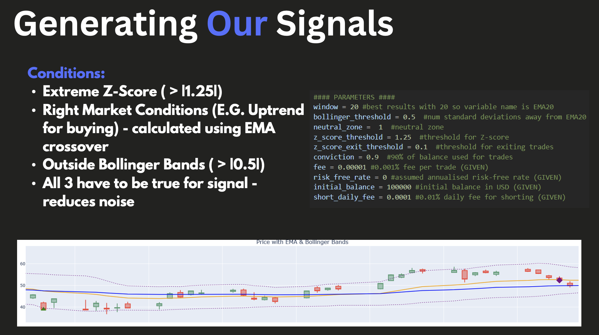
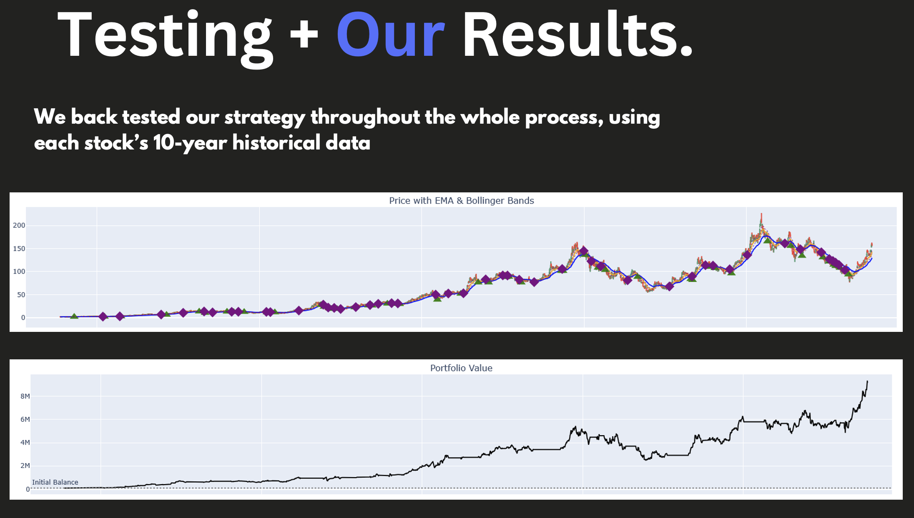
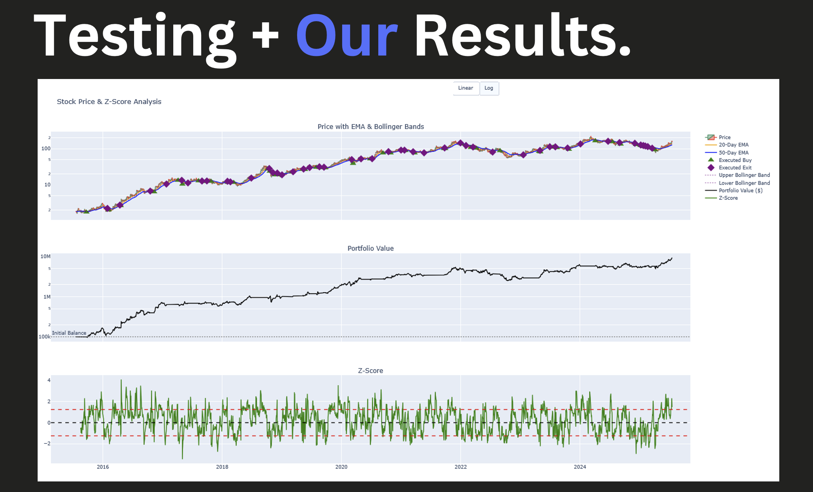
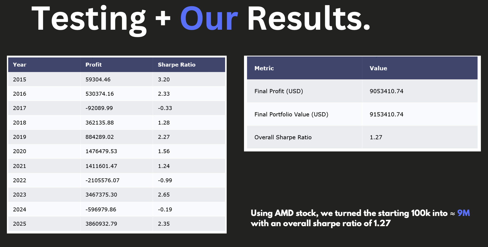

# Quantitative Trading Algorithm – G-Research Project

This project was developed during the **G-Research Quant Work Experience Programme**.

The objective was to design and implement a quantitative trading algorithm within **36 hours**, backtest it on historical market data, and present the results to engineers and quants.

The final strategy achieved a **Sharpe Ratio of 1.27**, ranking **1st out of 6 submissions** in the programme challenge.

---

# Key Results

Initial Capital: **$100,000**  
Final Portfolio Value: **~$9.15M**  
Sharpe Ratio: **1.27**  
Backtest Period: **~10 years of historical equity data**

---

# Strategy Visualisations

## Signal Generation Logic

The trading algorithm generates signals using a combination of statistical and technical indicators:

- **Z-score mean reversion** to detect extreme deviations from the mean  
- **EMA crossover** to confirm the market trend  
- **Bollinger Bands** to identify overbought or oversold price levels  

All three conditions must be satisfied before a trade signal is generated, which helps reduce noise and improve trade quality.

---

## Backtesting the Strategy

The strategy was backtested using **10 years of historical equity data**. The chart below shows price movements along with the generated trading signals.

---

## Portfolio Performance

The backtest tracks portfolio value over time as trades are executed by the algorithm.

---

## Final Results

Starting with an initial capital of **$100,000**, the strategy achieved a final portfolio value of approximately **$9.15M**.

**Overall Sharpe Ratio:** 1.27

---

# Strategy Overview

The algorithm implements a systematic trading strategy combining statistical mean reversion with technical momentum indicators.

The following signals are used:

- Bollinger Bands to detect overbought and oversold price levels  
- Z-score mean reversion to identify statistical deviations from the rolling mean  
- EMA crossovers to confirm short-term momentum shifts  

Trades are executed when multiple indicators align, increasing the probability of profitable entry and exit points.

---

# Backtesting

The strategy was backtested using **Python and pandas** on approximately **10 years of historical equity price data** across multiple stocks.

The backtesting framework simulates trading decisions based on the generated signals and evaluates performance using quantitative metrics commonly used in finance.

---

# Technology Stack

- Python  
- pandas  
- Financial time-series analysis  
- Statistical signal generation  
- Quantitative backtesting  

---

# Presentation

The full presentation explaining the strategy design, methodology, and results can be viewed at:
"Our Project. DFJ.pptx"

---

# Key Learnings

- Designing systematic trading strategies using statistical signals  
- Implementing technical indicators in Python using pandas  
- Backtesting trading strategies on historical financial data  
- Communicating quantitative research findings to engineers and quants
